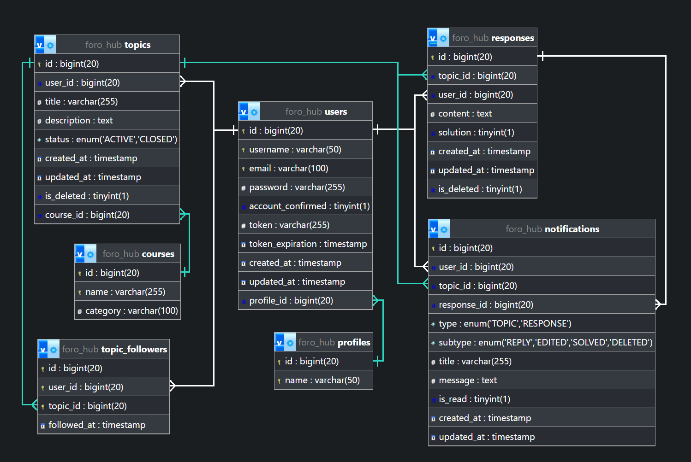
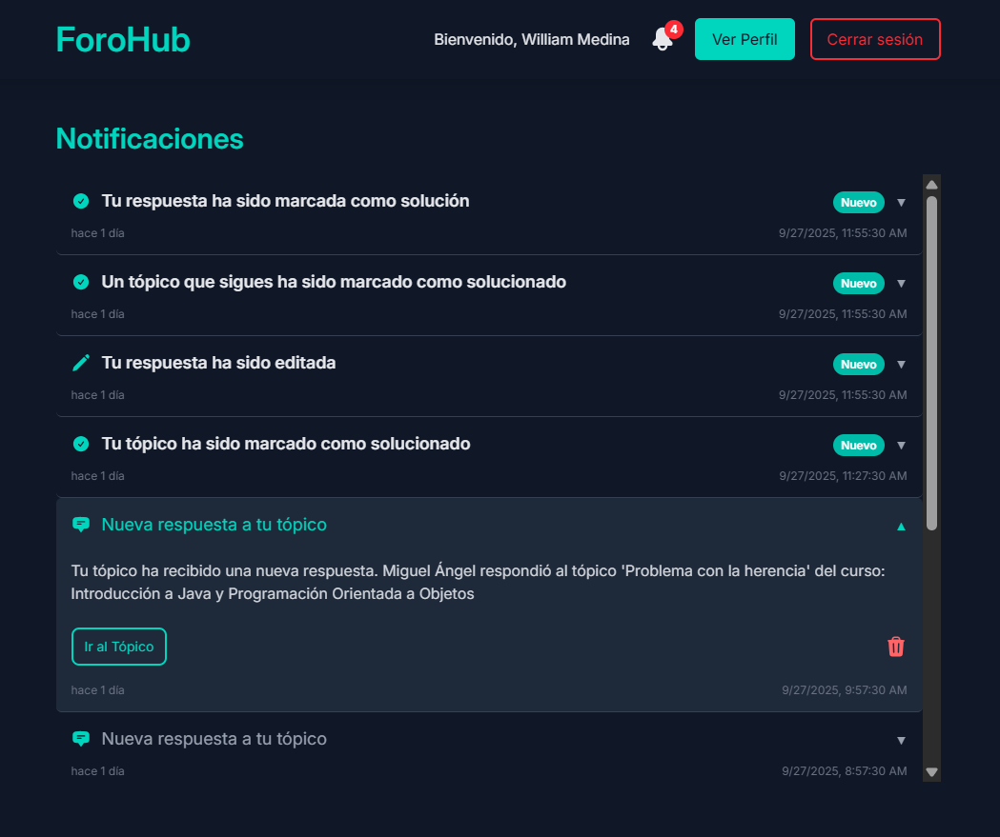

# ForoHub API


# Índice
1. [Descripción](#descripción)
2. [Características](#características)
3. [Tecnologías](#tecnologías)
4. [Dependencias](#dependencias)
5. [Requisitos](#requisitos)
6. [Diagrama de la Base de Datos](#diagrama-de-la-base-de-datos)
7. [Implementación de Inteligencia Artificial](#implementación-de-inteligencia-artificial)
8. [Instalación](#instalación)
9. [Guía de Uso](#guía-de-uso)
    - [Ejecución de la Aplicación](#ejecución-de-la-aplicación)
    - [Acceso a la API REST](#acceso-a-la-api-rest)
    - [Documentación de la API](#documentación-de-la-api)
    - [Colección para Postman](#colección-para-postman)
10. [Endpoints](#endpoints)
    - [Endpoints de Autenticación](#endpoints-de-autenticación)
    - [Endpoints de Tópicos](#endpoints-de-tópicos)
    - [Endpoints de Respuestas](#endpoints-de-respuestas)
    - [Endpoints de Notificaciones](#endpoints-de-notificaciones)
11. [Testing](#testing)
12. [Frontend](#frontend)
13. [Licencia](#licencia)
14. [Autor](#autor)

## Descripción

**ForoHub** es una API desarrollada con **Spring Boot** que permite la creación, administración y gestión de tópicos y respuestas para una plataforma de discusión basada en cursos. Los usuarios pueden registrarse, interactuar con los tópicos, responder a ellos, y gestionar sus perfiles. Los administradores, moderadores e instructores tienen permisos especiales para gestionar contenidos y marcar soluciones en los tópicos. Además, la API incluye una implementación de inteligencia artificial (IA) para detectar contenido inapropiado en los tópicos y respuestas, lo que mejora la experiencia de los usuarios al asegurar que el contenido compartido sea seguro y adecuado. Esta API está diseñada para ser utilizada junto a un frontend en React, permitiendo una integración fluida entre el backend y la interfaz de usuario.

## Características

- **Registro y autenticación de usuarios**: Los usuarios pueden registrarse, confirmar su cuenta mediante un token de confirmación y recuperar su password mediante un token de olvido.
- **Gestión de tópicos**: Los usuarios pueden crear, editar y eliminar sus propios tópicos.
- **Respuestas a tópicos**: Los usuarios pueden responder a los tópicos y editar o eliminar sus respuestas.
- **Cambio de perfil**: Los usuarios autenticados pueden modificar su nombre de usuario y password.
- **Seguimiento de tópicos**: Los usuarios pueden seguir tópicos para recibir notificaciones sobre nuevas respuestas o cambios en el estado. Además, los usuarios recibirán una notificación por email cuando haya una nueva actividad en un tópico que hayan seguido.
- **Notificaciones**: Los usuarios reciben notificaciones cuando se generan nuevas respuestas en un tópico que han creado o seguido, o cuando un tópico es marcado como solucionado. Estas notificaciones también se envían por email a los usuarios, asegurando que estén al tanto de los cambios importantes sin necesidad de estar constantemente revisando la plataforma.
- **Paginación y filtrado**: Los tópicos pueden ser filtrados por estado, palabras clave o curso, y la API soporta paginación para una mejor gestión de los contenidos.
- **Funciones de usuarios con permisos especiales**: Los moderadores, instructores y administradores tienen la capacidad de gestionar los tópicos y respuestas de otros usuarios. Pueden editar y eliminar tanto tópicos como respuestas, al igual que los usuarios que crearon dichos contenidos. Sin embargo, son los únicos que tienen la autoridad para marcar una respuesta como solución a un tópico.
- **Implementación de IA para moderación de contenido**: Se ha implementado Inteligencia Artificial para la detección de contenido inapropiado en los tópicos y respuestas, garantizando una experiencia más segura y saludable para los usuarios.

## Tecnologías
- **Spring Boot**: Framework que facilita el desarrollo ágil de aplicaciones en Java, permitiendo una configuración mínima.
- **MySQL**: Sistema de gestión de bases de datos relacional utilizado para almacenar la información de la API.
- **JWT (JSON Web Token)**: Tecnología para la autenticación y autorización de usuarios mediante tokens seguros.
- **API REST**: Protocolo de comunicación que permite realizar operaciones de consulta sobre los datos almacenados.
- **Springdoc OpenAPI**: Biblioteca para la generación automática de documentación de la API en aplicaciones Spring Boot, que utiliza **Swagger UI** para visualizar y probar los endpoints de manera interactiva.
- **Spring AI**: Biblioteca que integra inteligencia artificial en aplicaciones Spring Boot, permitiendo el uso de modelos de IA para tareas como análisis de contenido y procesamiento de lenguaje natural.

## Dependencias

Para que la API funcione correctamente, asegúrate de incluir las siguientes dependencias:

- **Spring Data JPA**: Facilita el acceso a bases de datos mediante la integración de JPA (Java Persistence API) para el manejo de datos en una base de datos relacional.
- **Spring Security**: Framework para la protección de aplicaciones mediante autenticación y autorización, gestionando la seguridad de la API.
- **Spring Boot Starter Validation**: Proporciona herramientas para validar objetos, parámetros de entrada y controlar los errores en la API.
- **Spring Boot Starter Web**: Proporciona las dependencias necesarias para construir una aplicación web, incluyendo controladores RESTful y manejo de solicitudes HTTP.
- **Flyway**: Herramienta para gestionar migraciones de bases de datos, que asegura que la estructura de la base de datos se mantenga consistente a lo largo del tiempo.
- **MySQL Connector**: Controlador JDBC para interactuar con bases de datos MySQL desde Java.
- **Lombok**: Biblioteca que facilita la creación de código repetitivo como getters, setters y constructores, usando anotaciones en el código.
- **Spring Boot DevTools**: Herramienta para mejorar la experiencia de desarrollo mediante recarga automática, depuración mejorada y más.
- **Java JWT (java-jwt)**: Biblioteca que permite trabajar con tokens JWT (JSON Web Tokens) para la autenticación y autorización de usuarios.
- **SpringDoc OpenAPI Starter**: Integra la especificación OpenAPI para documentar automáticamente los endpoints de la API.
- **Spring Boot Starter Mail**: Proporciona las herramientas necesarias para enviar correos electrónicos desde la aplicación, útil para el envío de correos de confirmación y recuperación de contraseñas.
- **Spring AI**: Proporciona herramientas para incorporar capacidades de inteligencia artificial en aplicaciones Spring Boot, como análisis de texto, automatización de respuestas y tareas de procesamiento de lenguaje natural.

Asegúrate de agregar las dependencias en el archivo `pom.xml` de tu proyecto Maven.

## Requisitos

- JDK 21 o superior
- Maven para la gestión de dependencias
- MySQL o cualquier base de datos relacional configurada
- IntelliJ IDEA (o cualquier otro IDE compatible con Java)
- Un servidor de email para el envio de notificaciones
- Credenciales de IA: Acceso a APIs de IA (ej. OpenAI)


## Diagrama de la Base de Datos

A continuación se muestra el diagrama de la base de datos que representa las tablas y las relaciones entre ellas:



Este diagrama proporciona una visión clara de la estructura de datos de la aplicación, detallando las relaciones entre las siguientes entidades principales:

- **Users**: Gestiona los datos de los usuarios.
- **Topics**: Representa los tópicos del foro creados por los usuarios.
- **Responses**: Contiene las respuestas asociadas a los tópicos.
- **Courses**: Relaciona los cursos con los tópicos.
- **Topic Followers**: Representa los usuarios que siguen un tópico.
- **Notifications**: Administra las notificaciones generadas por actividades en el foro.
- **Profiles**: Define los perfiles asociados a los usuarios.

Cada tabla está conectada de acuerdo con las relaciones necesarias para garantizar la consistencia de los datos.

## Implementación de Inteligencia Artificial

La API utiliza la inteligencia artificial para detectar contenido inapropiado en los tópicos, respuestas y nombres de usuario. Esta funcionalidad ayuda a garantizar que las interacciones dentro de la aplicación se mantengan dentro de los límites de respeto y seguridad. Se utiliza la API de OpenAI para procesar y verificar los datos, asegurando que el contenido generado o recibido cumpla con los estándares adecuados.

### Configuración de la API de OpenAI

Para utilizar la funcionalidad de detección de contenido inapropiado, es necesario configurar la clave de la API de OpenAI y el modelo que se utilizará para procesar las solicitudes. Asegúrate de tener la clave de la API de OpenAI disponible y activa.

1. **Configura la clave de la API de OpenAI:**

   - En tu archivo de configuración `application.properties`, añade la siguiente línea para configurar la clave de la API:

     ```properties
     spring.ai.openai.api-key=${AI_API_KEY}
     ```

   - Luego, asegúrate de que la variable de entorno `AI_API_KEY` esté configurada en tu sistema operativo o IDE con la clave de API proporcionada por OpenAI.


2. **Configura el modelo de IA para la detección de contenido inapropiado:**

   - En el archivo `application.properties`, también debes configurar el modelo que se utilizará para procesar las solicitudes de detección de contenido:

     ```properties
     spring.ai.openai.chat.options.model=gpt-4o-mini
     ```
   - El modelo de IA que se utilizará en este caso es `gpt-4o-mini`, aunque puedes ajustarlo según tus necesidades.

### Detección de Contenido Inapropiado

La inteligencia artificial se encarga de verificar el contenido ingresado por los usuarios, incluyendo nombres de usuario, tópicos y respuestas. Si se detecta contenido inapropiado, la API enviará un mensaje de error y evitará que el usuario cree o actualice un tópico, respuesta o nombre de usuario.

## Instalación

1. **Clona el repositorio**:
    ```bash
    git clone https://github.com/william-medina/forohub-api.git
    ```

2. **Accede al directorio del proyecto**:
    ```bash
    cd forohub-api
    ```

3. **Agrega las variables de entorno**:  
   A continuación, agrega las siguientes variables de entorno directamente en la configuración de tu sistema operativo o IDE.

   ```dotenv
   # Base de Datos
   DB_URL=jdbc:mysql://localhost:3306/your_database_name
   DB_USERNAME=your_username
   DB_PASSWORD=your_password

   # Clave Secreta para JWT
   JWT_SECRET=your_secret_jwt

   # Configuración del Servidor de Email
   EMAIL_HOST=your_email_host
   EMAIL_PORT=your_email_port
   EMAIL_USER=your_email_user
   EMAIL_PASS=your_email_password
   EMAIL_FROM=your_email_from
   EMAIL_ENABLED=true

   # URL del Frontend - Habilita CORS para permitir peticiones desde esta URL
   FRONTEND_URL=http://localhost:5173
   
   # Configuración de la Funcionalidad de IA
   AI_API_KEY=your_openai_api_key
   AI_ENABLED=true
   ```
   Reemplaza los valores de ejemplo con los detalles de tu configuración real.


4. **Habilitar o deshabilitar el envío de email:**

   Si no tienes un servidor de email o las credenciales correspondientes, puedes deshabilitar el envío de emails para evitar que el sistema intente enviar notificaciones por email, lo que podría generar errores debido a la falta de credenciales. Deshabilitar el envío de emails garantizará que el sistema no intente enviar los tokens para la confirmación de cuenta o el restablecimiento de contraseña, ni las notificaciones sobre el seguimiento de tópicos o cambios en el estado de los mismos.

   Para hacerlo, puedes utilizar la variable de entorno `EMAIL_ENABLED` y configurarla de la siguiente manera:

   - En tu archivo de configuración (por ejemplo, `application.properties`), añade la siguiente línea:

     ```properties
     email.enabled=${EMAIL_ENABLED:true}
     ```

   - Luego, configura la variable de entorno `EMAIL_ENABLED` en tu sistema operativo o IDE. Si deseas deshabilitar el envío de emails, establece la variable en `false`. Si quieres habilitarlo, configúralo en `true`.

   > **Importante:** Al deshabilitar el envío de emails, algunos procedimientos de la API, como el proceso de creación de cuentas, no podrán completarse correctamente, ya que no se enviará el email necesario para el envío del token de confirmación. Esto significa que la cuenta nunca será confirmada y no podrá ser activada.

5. **Habilitar o deshabilitar la funcionalidad de IA:**

   Si no cuentas con las credenciales necesarias o simplemente deseas deshabilitar la funcionalidad de IA, puedes desactivar esta característica. Esto evitará que el sistema realice validaciones de contenido, lo que podría ahorrar recursos y prevenir posibles errores causados por credenciales incorrectas o inexistentes.

   Para hacerlo, puedes configurar la variable de entorno `AI_ENABLED` de la siguiente manera:

   - En tu archivo de configuración (por ejemplo, `application.properties`), añade la siguiente línea:

     ```properties
     ai.enabled=${AI_ENABLED:true}
     ```

   - Luego, configura la variable de entorno `AI_ENABLED` en tu sistema operativo o IDE. Si deseas deshabilitar la IA, establece la variable en `false`. Si quieres habilitar la funcionalidad de IA, configúralo en `true`.

   > **Importante:** Si deshabilitas la funcionalidad de IA, los contenidos no serán validados antes de ser procesados, lo que podría permitir que se envíe contenido inapropiado.


6. **Asegúrate de que todas las dependencias estén instaladas** utilizando la opción de **"Actualizar Proyecto"** o **"Importar dependencias"** en tu IDE.


## Guía de Uso

### Ejecución de la Aplicación
- Para iniciar la aplicación, ejecuta la clase `ForohubApplication` desde tu IDE o en la línea de comandos. Esta clase contiene el método `main`, que inicia la aplicación.

### Acceso a la API REST
- Una vez que la aplicación esté en ejecución, podrás acceder a la API REST a través de la URL base:
  ```
  http://localhost:8080/api
  ```
- Asegúrate de que el puerto configurado en tu aplicación sea el correcto (por defecto, es 8080).

### Documentación de la API
- La documentación de la API está disponible a través de [Swagger UI](http://localhost:8080/api/docs/swagger-ui/index.html) una vez que la aplicación esté ejecutándose. Esta herramienta te permite explorar todos los endpoints disponibles y realizar pruebas directamente desde tu navegador, facilitando la interacción con la API.
   ```
   http://localhost:8080/api/docs/swagger-ui/index.html
   ```

- Si deseas deshabilitar la documentación de la API en su entorno de desarrollo o producción, puedes hacerlo modificando las siguientes líneas en tu archivo `application.properties` y estableciéndolas en `false`:

    ```properties
    springdoc.api-docs.enabled=false
    springdoc.swagger-ui.enabled=false
    ```

    Esto deshabilitará tanto la generación de la documentación de la API como la interfaz de usuario de Swagger.

### Colección para Postman
- Se incluye una colección de Postman con todas las solicitudes configuradas para facilitar las pruebas de la API. Esta colección permite explorar los endpoints y realizar peticiones rápidamente sin necesidad de configurarlas manualmente.
- Importa el archivo `ForoHub.postman_collection.json` desde la carpeta `docs/postman` en Postman utilizando la opción "Importar". Una vez importado, podrás comenzar a interactuar con la API de forma inmediata.

  ```
  docs/postman/ForoHub.postman_collection.json
  ```
  
## Endpoints
A continuación, se presenta la lista completa de endpoints disponibles en la API. Todos los endpoints comienzan con el prefijo `/api`.

### Endpoints de Autenticación
Estos endpoints permiten gestionar las cuentas de usuario, desde la creación hasta la actualización de password y nombres de usuario, así como la obtención de detalles y estadísticas del usuario autenticado.

| Endpoint                            | Método      | Descripción                                                                      |
|-------------------------------------|-------------|----------------------------------------------------------------------------------|
| `/auth/create-account`              | `POST`      | Crea una cuenta de usuario en el sistema.                                        |
| `/auth/confirm-account/{token}`     | `GET`       | Confirma la cuenta de usuario utilizando un token proporcionado.                 |
| `/auth/login`                       | `POST`      | Inicia sesión, autenticando al usuario y generando un token JWT.                 |
| `/auth/request-code`                | `POST`      | Solicita un nuevo código de confirmación y lo envía al email del usuario.        |
| `/auth/forgot-password`             | `POST`      | Genera un token de restablecimiento de password y lo envía al email del usuario. |
| `/auth/update-password/{token}`     | `POST`      | Permite actualizar el password utilizando un token de restablecimiento.          |
| `/auth/update-password`             | `PATCH`     | Permite al usuario autenticado actualizar su password actual.                    |
| `/auth/update-username`             | `PATCH`     | Permite al usuario autenticado actualizar su nombre de usuario.                  |
| `/auth/stats`                       | `GET`       | Obtiene estadísticas del usuario autenticado.                                    |
| `/auth/me`                          | `GET`       | Obtiene los detalles del usuario actualmente autenticado.                        |
---

### Endpoints de Tópicos
Estos endpoints gestionan la creación, obtención, actualización y eliminación de tópicos, así como el seguimiento de los mismos por parte de los usuarios. La eliminación de un tópico es lógica, es decir, no se elimina físicamente de la base de datos, sino que se marca como eliminado.

| Endpoint                                      | Método      | Descripción                                                                                             |
|-----------------------------------------------|-------------|---------------------------------------------------------------------------------------------------------|
| `/topic`                                      | `POST`      | Crea un nuevo tópico con los datos proporcionados.                                                      |
| `/topic`                                      | `GET`       | Obtiene todos los tópicos con paginación y filtrado opcional por curso, palabra clave y estado.         |
| `/topic/user/topics`                          | `GET`       | Obtiene los tópicos creados por el usuario con paginación y filtrado opcional por palabra clave.        |
| `/topic/{topicId}`                            | `GET`       | Obtiene un tópico específico por su ID, incluyendo todas sus respuestas.                                |
| `/topic/{topicId}`                            | `PUT`       | Actualiza los detalles de un tópico existente. Si el tópico es editado por un moderador, instructor o administrador, el creador recibirá una notificación y un email.|
| `/topic/{topicId}`                            | `DELETE`    | Elimina un tópico de manera lógica. El creador recibirá una notificación y un email si el tópico es eliminado por un moderador, instructor o administrador.                                                            |
| `/topic/follow/{topicId}`                     | `POST`      | Permite a un usuario seguir o dejar de seguir un tópico específico.                                     |
| `/topic/user/followed-topics`                 | `GET`       | Obtiene los tópicos seguidos por el usuario con paginación y filtrado opcional por palabra clave.       |
---

### Endpoints de Respuestas
Los endpoints de respuestas gestionan la creación, actualización, eliminación y la posibilidad de marcar una respuesta como solución. Al igual que los tópicos, la eliminación de respuestas es lógica.

| Endpoint                                 | Método      | Descripción                                                                                                                                                                                                                                                                                             |
|------------------------------------------|-------------|---------------------------------------------------------------------------------------------------------------------------------------------------------------------------------------------------------------------------------------------------------------------------------------------------------|
| `/response`                              | `POST`      | Crea una respuesta para un tópico. Si se agrega una respuesta, el creador del tópico y los usuarios que lo siguen recibirán notificaciones y emails informándoles.                                                                                                                                      |
| `/response/user/responses`               | `GET`       | Obtiene todas las respuestas del usuario autenticado con paginación.                                                                                                                                                                                                                                    |
| `/response/{responseId}`                 | `GET`       | Obtiene una respuesta específica utilizando su ID.                                                                                                                                                                                                                                                      |
| `/response/{responseId}`                 | `PUT`       | Actualiza una respuesta. Si la actualización la hace un moderador, instructor o administrador, solo se notifica al creador de la respuesta.                                                                                                                                                             |
| `/response/{responseId}`                 | `PATCH`     | Alterna el estado de una respuesta como solución o la quita si ya estaba marcada como solución. Además, actualiza el estado del tópico, indicándole si está activo o cerrado. Al hacerlo, Se notificará al creador de la respuesta, al creador del tópico, y a todos los usuarios que siguen el tópico. |
| `/response/{responseId}`                 | `DELETE`    | Elimina una respuesta de manera lógica. Si un moderador, instructor o administrador la elimina, solo se notifica al creador de la respuesta.                                                                                                                                                            |
---

### Endpoints de Notificaciones
Estos endpoints gestionan las notificaciones del usuario, permitiendo obtenerlas, eliminarlas o marcarlas como leídas.

| Endpoint                             | Método       | Descripción                                                                                                      |
|--------------------------------------|--------------|------------------------------------------------------------------------------------------------------------------|
| `/notify`                            | `GET`        | Obtiene todas las notificaciones del usuario autenticado, ordenadas por fecha de creación.                       |
| `/notify/{notifyId}`                 | `DELETE`     | Elimina una notificación específica por su ID, si pertenece al usuario autenticado.                             |
| `/notify/{notifyId}`                 | `PATCH`      | Marca como leída una notificación específica por su ID, si pertenece al usuario autenticado.                    |
---

### Endpoint de Cursos
Este endpoint permite obtener información sobre los cursos disponibles en la API.

| Endpoint            | Método   | Descripción                                                                                 |
|---------------------|----------|---------------------------------------------------------------------------------------------|
| `/course`           | `GET`    | Recupera todos los cursos disponibles en la API, ordenados alfabéticamente por su nombre.  |


## Testing

La API cuenta con pruebas unitarias para cada repositorio y controlador. Estas pruebas están diseñadas para garantizar el correcto funcionamiento de la API. Cada prueba interactúa con una base de datos de pruebas, lo que permite realizar validaciones sin afectar los datos reales.

### Configuración de la base de datos para las pruebas

Antes de ejecutar las pruebas, es necesario configurar una base de datos separada que se utilizará exclusivamente para las pruebas. Esto garantiza que las pruebas no interfieran con los datos de producción. Para configurar la base de datos de pruebas, debes agrega las siguientes variables de entorno directamente en la configuración de tu sistema operativo o IDE.

```dotenv
# Configuración de la base de datos para test
DB_URL_TEST=jdbc:mysql://localhost:3306/your_database_name_test?createDatabaseIfNotExist=true
DB_USERNAME_TEST=your_username
DB_PASSWORD_TEST=your_password
```
> **Importante**: El nombre de la base de datos debe ser diferente al de la base de datos principal. Esto es crucial porque cada prueba limpia los registros de las tablas al iniciar, garantizando que los tests sean independientes y no afecten los datos de producción.

- Al ejecutar las pruebas, el envío de email se deshabilitará automáticamente. Esto se hace para evitar que se envíen emails durante las pruebas, ya que no se requiere este comportamiento en este entorno.

- **Sugerencia**: Si la API utiliza inteligencia artificial, es recomendable deshabilitarla temporalmente durante las pruebas unitarias para evitar el consumo innecesario de recursos. Para lograr esto, puedes configurar la variable de entorno `AI_ENABLED` a `false` en el entorno de pruebas. Así, la inteligencia artificial estará deshabilitada durante las pruebas, lo que optimiza el uso de recursos.

## Frontend
La API cuenta con un frontend desarrollado en **React** utilizando **TypeScript** y **Tailwind CSS**. Este frontend está diseñado para interactuar de manera efectiva con la API.

### Acceso al Repositorio
El código fuente está disponible en el siguiente enlace:

👉 [Repositorio del Frontend en GitHub](https://github.com/william-medina/forohub-app)

### Ver el Proyecto en Producción
Puedes ver la aplicación en producción, ya conectada con la API, en el siguiente enlace:

👉 [Ver Proyecto en Producción](https://forohub.william-medina.com)

> **⚠️ Importante**: Si la API ha estado inactiva por un tiempo, es posible que debas esperar unos momentos mientras el servidor se inicia. El proceso puede tardar unos minutos.

### Características Destacadas del Frontend
- **Interfaz Responsiva**: Diseñada para ofrecer una experiencia de usuario fluida en dispositivos móviles y de escritorio.
- **Conexión Eficiente a la API**: Conexión en tiempo real con la API REST para garantizar una comunicación fluida y la actualización dinámica de los datos mostrados en la interfaz.
- **Componentes Reutilizables**: Estructura modular que simplifica el mantenimiento y la escalabilidad de la aplicación.

### Imágenes del Frontend


A continuación, se presentan algunas capturas de pantalla del frontend de algunas paginas:

#### Página de Inicio:


#### Detalles de los Tópicos:


#### Página de Perfil:


#### Notificaciones:


## Licencia

Este proyecto está bajo la Licencia MIT. Para más detalles, consulta el archivo [LICENSE](./LICENSE).

## Autor

**William Medina**  
Autor y desarrollador de **ForoHub API**. Puedes encontrarme en [GitHub](https://github.com/william-medina)